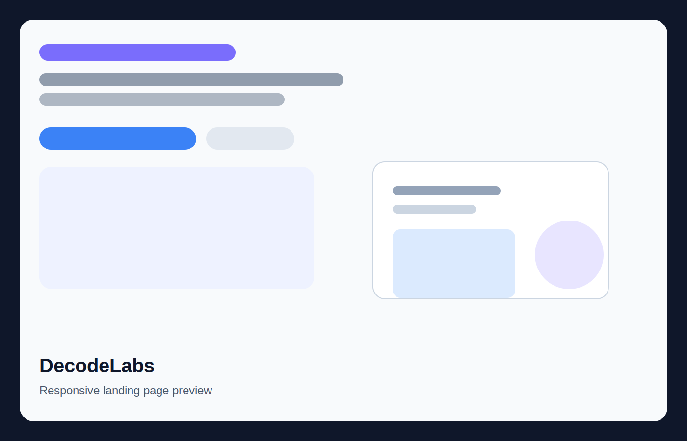
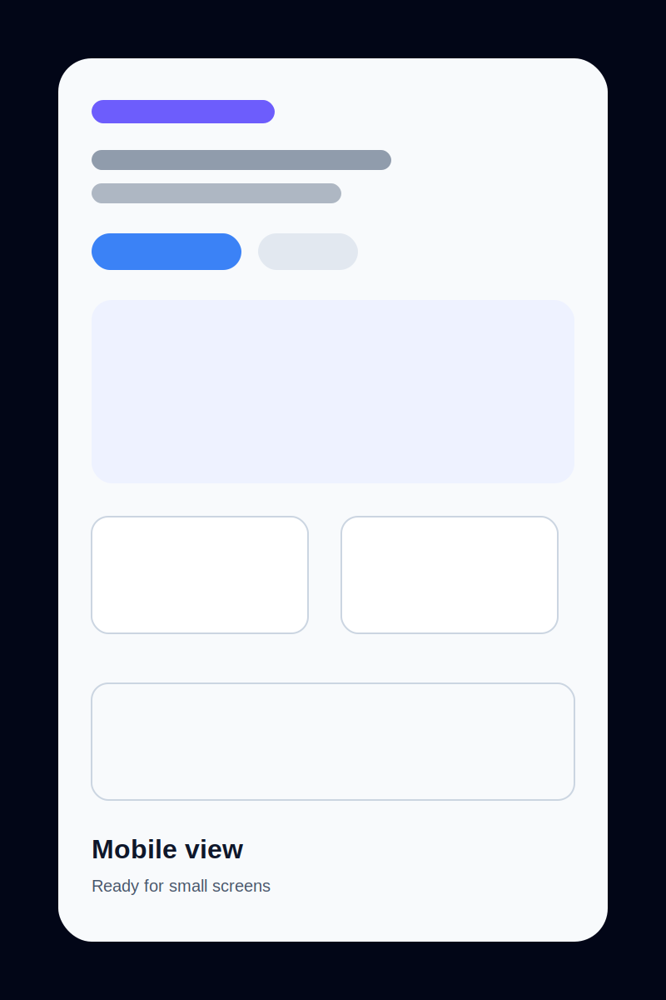
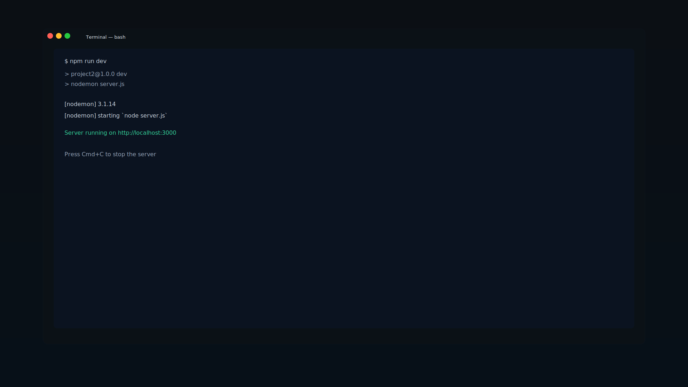
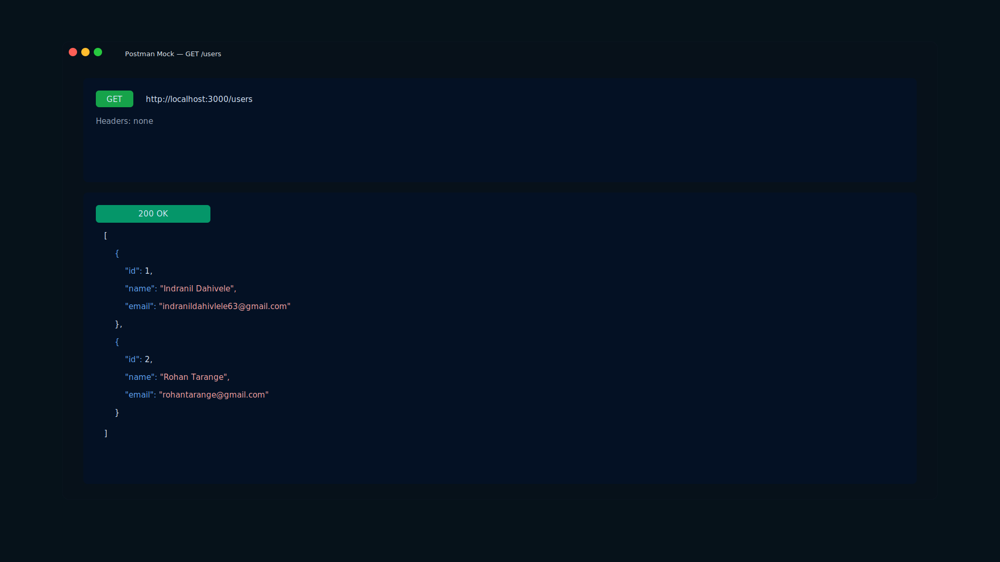

# DECODELABS — Internship Projects 🚀

    

Professional portfolio repository for two internship-style projects: a responsive frontend landing page and a backend user management API.

## Project Overview

This repository demonstrates clean frontend and backend engineering with polished documentation, modular architecture, and reproducible local setup. It is optimized for recruiter review and open-source presentation.

## ⭐ Highlights

- Responsive landing page built with HTML5, CSS3, and JavaScript
- User management REST API built with Node.js and Express.js
- Modular architecture with a clear and professional project structure
- Clean, recruiter-friendly documentation
- Input validation and robust error handling
- Well-organized GitHub presentation for portfolio review

## 📸 Project Preview

### 🌐 Project 1 — Responsive Landing Page





---

### 🚀 Project 2 — User Management API





## Projects 📁

| Project | Type | Description |
|---------|------|-------------|
| [Project 1 – Responsive Landing Page](Project1/README.md) | Frontend | Agency-style responsive homepage with accessible interactions |
| [Project 2 – User Management API](Project2/README.md) | Backend | Express.js REST API for CRUD operations with validation |

## 🛠 Tech Stack

### Frontend
- HTML5
- CSS3
- JavaScript

### Backend
- Node.js
- Express.js
- CORS
- Nodemon

### Tools
- Git
- GitHub
- VS Code
- Postman

## 📚 Skills Demonstrated

- Responsive Web Design
- REST API Development
- CRUD Operations
- Express Middleware
- Error Handling
- Input Validation
- Git & GitHub Workflow
- Documentation
- Project Structure
- RESTful Architecture

## Repository Structure 📂

```text
DECODELABS-INTERNSHIP/
├── README.md
├── LICENSE
├── Project1/
└── Project2/
```

## Installation

Clone the repository and install dependencies for the project you want to run.

```bash
git clone https://github.com/officialindranildahivele/DECODELABS-INTERNSHIP.git
```

### Run Project 2 (API)

```bash
cd DECODELABS-INTERNSHIP/Project2
npm install
npm run dev
```

### Run Project 1 (Landing Page)

```bash
cd DECODELABS-INTERNSHIP/Project1
python3 server.py
```

Then open:

```text
http://localhost:8000
```

## Author 👨‍💻

**Indranil Dahivele** — https://github.com/officialindranildahivele

## License

MIT License — see the `LICENSE` file for details.

## 📌 Key Takeaways

This repository showcases practical frontend and backend development completed during the DecodeLabs Internship, with emphasis on clean code, modular architecture, documentation, Git workflow, and software engineering best practices.
